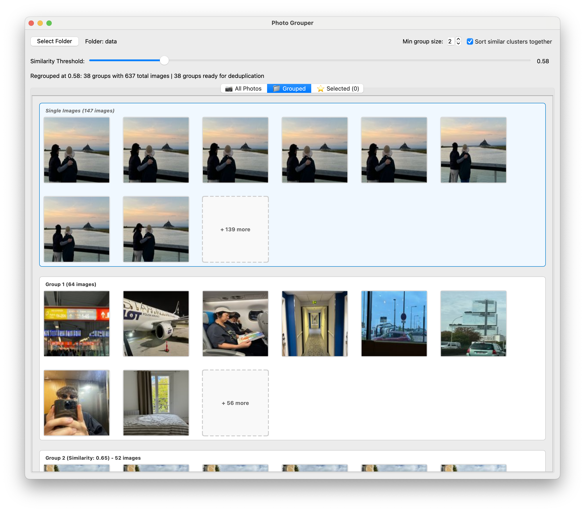

# Photo Grouper

A desktop application for intelligently grouping similar photos using machine learning embeddings and cosine similarity. Built with Python, PyQt6, and VGG16 neural network features.



## Features

- **Smart Photo Grouping**: Automatically groups similar photos using deep learning embeddings
- **Real-time Threshold Adjustment**: Dynamically regroup photos by adjusting similarity threshold with a slider
- **Duplicate Detection**: Identifies and manages duplicate images based on file hashes
- **Async Image Loading**: Smooth UI experience with background image loading and priority queuing
- **Multiple Sessions**: Manage different grouping sessions for various photo collections
- **Export Functionality**: Export selected groups to organized folders
- **Format Support**: Works with JPG, PNG, HEIC, HEIF, BMP, TIFF, and WebP formats

## Installation

### Prerequisites

- Python 3.8 or higher
- pip package manager

### Setup

1. Clone the repository:
```bash
git clone https://github.com/junha6316/photo-grouper.git
cd photo-grouper
```

2. Install dependencies:
```bash
pip install -r requirements.txt
```

## Usage

### Basic Usage

Run the application:
```bash
python app.py
```

1. Click "Select Folder" to choose a directory containing images
2. Wait for the application to scan and process images
3. Adjust the similarity threshold slider (0.50-0.99) to change grouping sensitivity
4. Click on any group to view detailed images
5. Select images and export them to organized folders

### Features Guide

#### Similarity Threshold
- **Higher values (0.90-0.99)**: Groups only very similar photos
- **Medium values (0.80-0.89)**: Balanced grouping for most use cases
- **Lower values (0.50-0.79)**: Groups moderately similar photos

#### Selection Management
- Click images to select/deselect
- Use "Select All" / "Deselect All" buttons in group views
- View all selected images via "View Selected" button
- Export selected images to a target folder

#### Duplicate Management
- Access via "Find Duplicates" button
- Review and manage exact duplicate files
- Keep one copy and remove others safely

## Technical Details

### Architecture

The application uses a modular architecture:

- **Core Processing** (`core/`): Image scanning, embedding generation, similarity grouping
- **Infrastructure** (`infra/`): SQLite caching, persistence layer
- **User Interface** (`ui/`): PyQt6-based GUI with responsive components
- **UI Components** (`ui/components/`): Reusable widgets and layouts

### ML Pipeline

1. **Feature Extraction**: VGG16 convolutional neural network (pre-trained on ImageNet)
2. **Dimensionality Reduction**: PCA to optimize computation while preserving variance
3. **Similarity Computation**: Cosine similarity between L2-normalized embeddings
4. **Graph-based Grouping**: NetworkX connected components for cluster formation

### Performance

- **Caching**: SQLite database stores computed embeddings to avoid reprocessing
- **Tiled Processing**: Memory-efficient similarity computation for large datasets
- **Lazy Loading**: Images loaded on-demand with viewport prioritization
- **Threading**: Background processing keeps UI responsive

## Development

### Project Structure

```
photo-grouper/
├── app.py                 # Application entry point
├── core/                  # Core processing logic
│   ├── scanner.py        # Image discovery
│   ├── embedder.py       # ML feature extraction
│   ├── grouper.py        # Similarity grouping
│   └── deduplicator.py   # Duplicate detection
├── infra/                # Infrastructure layer
│   └── cache_db.py       # Embedding cache
├── ui/                   # User interface
│   ├── main_window.py    # Main application window
│   ├── preview_panel.py  # Thumbnail grid
│   └── components/       # Reusable UI components
└── tests/                # Test suite
```

### Development Commands

```bash
# Clean Python cache
find . -type d -name __pycache__ -exec rm -rf {} + 2>/dev/null || true

# Clear embedding cache
rm -rf ~/.photo_grouper/embeddings.db

# Run with memory profiling
python -m memory_profiler app.py
```

## Configuration

The application stores configuration and cache in:
- **Cache**: `~/.photo_grouper/embeddings.db`
- **Settings**: Platform-specific user config directory

## Requirements

Key dependencies:
- PyQt6 - GUI framework
- NumPy - Numerical computations
- Pillow - Image processing
- scikit-learn - PCA and preprocessing
- tensorflow/keras - VGG16 model
- NetworkX - Graph algorithms
- pillow-heif - HEIC/HEIF support

## License

MIT License - see the [LICENSE](LICENSE) file for details

## Contributing

Contributions are welcome! Please feel free to submit a Pull Request.

## Support

For issues and questions, please use the GitHub issue tracker.